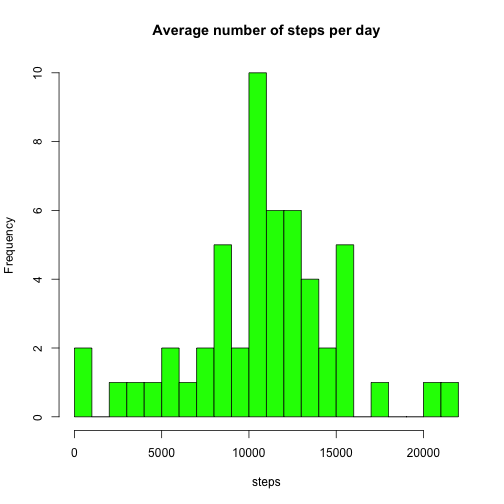
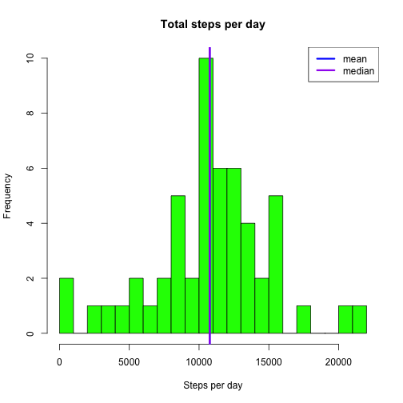
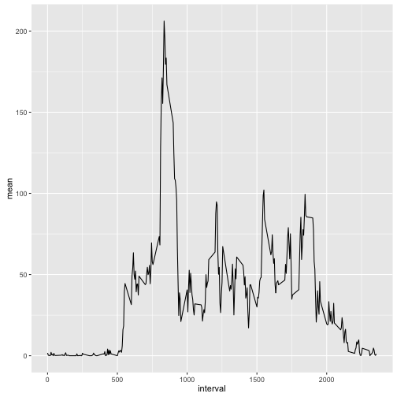
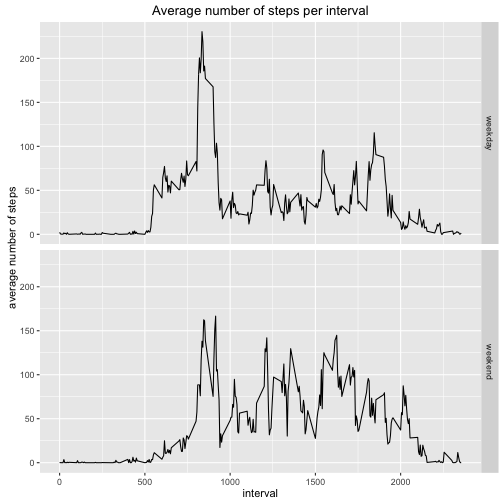

#Reproducible Research: Cource Project 1


```r
knitr::opts_chunk$set(echo=TRUE, warning=FALSE, message=FALSE)
```

##Loading and preprocessing the data

Set the working directory and read the data into variable "activity""

```r
setwd("~/Desktop/Data science/Reproducible Research/Project 1")
activity <- read.csv("./activity.csv")
str(activity)
```

```
## 'data.frame':	17568 obs. of  3 variables:
##  $ steps   : int  NA NA NA NA NA NA NA NA NA NA ...
##  $ date    : Factor w/ 61 levels "2012-10-01","2012-10-02",..: 1 1 1 1 1 1 1 1 1 1 ...
##  $ interval: int  0 5 10 15 20 25 30 35 40 45 ...
```


```r
summary(activity)
```

```
##      steps                date          interval     
##  Min.   :  0.00   2012-10-01:  288   Min.   :   0.0  
##  1st Qu.:  0.00   2012-10-02:  288   1st Qu.: 588.8  
##  Median :  0.00   2012-10-03:  288   Median :1177.5  
##  Mean   : 37.38   2012-10-04:  288   Mean   :1177.5  
##  3rd Qu.: 12.00   2012-10-05:  288   3rd Qu.:1766.2  
##  Max.   :806.00   2012-10-06:  288   Max.   :2355.0  
##  NA's   :2304     (Other)   :15840
```

Change date column to the proper format

```r
activity$date <- as.Date(activity$date, "%Y-%m-%d")
```

##What is mean total number of steps taken per day?

###1. Calculate the total number of steps taken per day


```r
library(dplyr)
day_steps <- summarise(group_by(activity, date), sum(steps))
names(day_steps) [2] <- "steps"
print(day_steps)
```

```
## Source: local data frame [61 x 2]
## 
##          date steps
##        (date) (int)
## 1  2012-10-01    NA
## 2  2012-10-02   126
## 3  2012-10-03 11352
## 4  2012-10-04 12116
## 5  2012-10-05 13294
## 6  2012-10-06 15420
## 7  2012-10-07 11015
## 8  2012-10-08    NA
## 9  2012-10-09 12811
## 10 2012-10-10  9900
## ..        ...   ...
```

###2. Make a histogram of the total number of steps taken each day


```r
hist(na.omit(day_steps$steps), col = "green", breaks = 20, main = "Average number of steps per day", xlab = "steps")
```



###3. Calculate and report the mean and median of the total number of steps 
###taken per day


```r
mean_steps <- mean(day_steps$steps, na.rm = TRUE)
print(mean_steps)
```

```
## [1] 10766.19
```

```r
median_steps <- median(day_steps$steps, na.rm = TRUE)
print (median_steps) 
```

```
## [1] 10765
```

As calculated, mean of steps equals 10766 steps per day and median of steps per 
day is 10765.

Let's see the histogram


```r
hist(day_steps$steps, main="Total steps per day",xlab="Steps per day", 
     breaks = 30, col = "green")
abline(v = mean_steps, col = "blue", lwd = 3)
abline(v = median_steps, col = "purple", lwd = 3)
legend(legend = c("mean", "median"), lwd = 3, col = c("blue", "purple"), 
       "topright")
```


As on the histogram, mean and median are very close to each other and both are 
in the group with highest frequency rate. 

##What is the average daily activity pattern?

###1. Make a time series plot (i.e. type = "l") of the 5-minute interval (x-axis) 
###and the average number of steps taken, averaged across all days (y-axis)


```r
interval_steps <- summarise(group_by(activity, interval), mean = mean(steps, na.rm = TRUE))
library(ggplot2)
ggplot(data = interval_steps, aes(interval, mean)) + geom_line()
```



###2. Which 5-minute interval, on average across all the days in the dataset, 
###contains the maximum number of steps?


```r
max_steps <- interval_steps$interval [interval_steps$mean == 
                                              max(interval_steps$mean)]
print(max_steps)
```

```
## [1] 835
```

As seen previously on the plot, an interval with the maximum steps is 835.

##Imputing missing values

###1. Calculate and report the total number of missing values in the dataset 
###(i.e. the total number of rows with NAs)

```r
sum(is.na(activity))
```

```
## [1] 2304
```
 
Overall number of missing values is 2304. 


```r
mean(is.na(activity))
```

```
## [1] 0.04371585
```
But considering that it is only 4.3% of the data, we might not bother about it.  

### 2. Devise a strategy for filling in all of the missing values in the dataset

The main strategy for filling in a missing value is to replace it with an average 
value for the interval it is assigned to. Average number of steps for each 
interval was calculated before and is stored in variable interval_steps.


```r
steps_new <- numeric(nrow(activity))
for (i in 1:nrow(activity)) {
        if (is.na(activity[i,1])==TRUE) {
                steps_new[i] <- interval_steps$mean [interval_steps$interval == 
                                                      activity[i, 3]]
        } else {
                 steps_new[i] <- activity [i,1]      
                }
            
}
```

### 3.Create a new dataset that is equal to the original dataset but with the 
###missing data filled in

To create a new data set we will use cbind function to bind a new vector of 
replaced values and date and interval variables from activity data.


```r
activity_na_rm <- cbind(steps_new, activity[,2:3])
sum(is.na(activity_na_rm))
```

```
## [1] 0
```

```r
head(activity_na_rm)
```

```
##   steps_new       date interval
## 1 1.7169811 2012-10-01        0
## 2 0.3396226 2012-10-01        5
## 3 0.1320755 2012-10-01       10
## 4 0.1509434 2012-10-01       15
## 5 0.0754717 2012-10-01       20
## 6 2.0943396 2012-10-01       25
```

The new dataset activity_na_rm was tested for NA values. No NA values were 
found.

###4. Make a histogram of the total number of steps taken each day and Calculate 
###and report the mean and median total number of steps taken per day

To make a histogram the same strategy was used as before. The data was grouped 
by date and summary statistics (sum) was calculated for steps_new variable. 


```r
day_steps_na_rm <- summarise(group_by(activity_na_rm, date), sum(steps_new))
names(day_steps_na_rm) [2] <- "steps"
summary(day_steps_na_rm$steps)
```

```
##    Min. 1st Qu.  Median    Mean 3rd Qu.    Max. 
##      41    9819   10770   10770   12810   21190
```

As seen from the summary statistics mean = 10770 and median = 10770 as well.


```r
print(c(mean_steps, median_steps))
```

```
## [1] 10766.19 10765.00
```

Comparing to the results of the previous analysis, we can see that mean and median
values have increased. The impact is not very great (4 steps for mean and 5 steps
for median out of the value of 10770 steps for both statistics). It might be the 
case that missing values are found in the intervals with higher average number 
of steps. So replacing an NA with an average for it's interval causes the whole
set to produce higher mean and median.

##Are there differences in activity patterns between weekdays and weekends?

###1.Create a new factor variable in the dataset with two levels - "weekday" and
###"weekend" indicating whether a given date is a weekday or a weekend day.

To assign a vector of values to day_type variable "wday" function was used. 
Saturday and Sunday are represented by 7 and 1 respectfully, so these fuction 
outputs were marked with "weekend" level. All other outputs were assigned 
"weekday" level. Final vector day_type was binded to activity_na_rm dataset


```r
library(lubridate)
day_type <- numeric(nrow(activity))
for (i in 1:nrow(activity)) {
        if (wday(activity_na_rm$date[i]) ==1 | wday(activity_na_rm$date[i]) ==7) {
                day_type[i] <- "weekend"
        } else {
                day_type[i] <- "weekday"      
                }
            
}
day_type <- as.factor(day_type)
activity_week <- cbind(activity_na_rm[,1:2], day_type, activity_na_rm[,3])
head(activity_week)
```

```
##   steps_new       date day_type activity_na_rm[, 3]
## 1 1.7169811 2012-10-01  weekday                   0
## 2 0.3396226 2012-10-01  weekday                   5
## 3 0.1320755 2012-10-01  weekday                  10
## 4 0.1509434 2012-10-01  weekday                  15
## 5 0.0754717 2012-10-01  weekday                  20
## 6 2.0943396 2012-10-01  weekday                  25
```

###2.Make a panel plot containing a time series plot (i.e. type = "l") of the 5-minute interval (x-axis) and the average number of steps taken, averaged across all weekday days or weekend days (y-axis)


```r
names(activity_week) [1] <- "steps"
names(activity_week) [4] <- "interval"
avg_per_day <- summarise(group_by(activity_week, interval, day_type), 
                         mean = mean(steps))
ggplot(data=avg_per_day, aes(interval, mean)) + geom_line()+ 
        facet_grid (day_type~.) + labs(y ="average number of steps",title = 
                                               "Average number of steps per interval")
```


